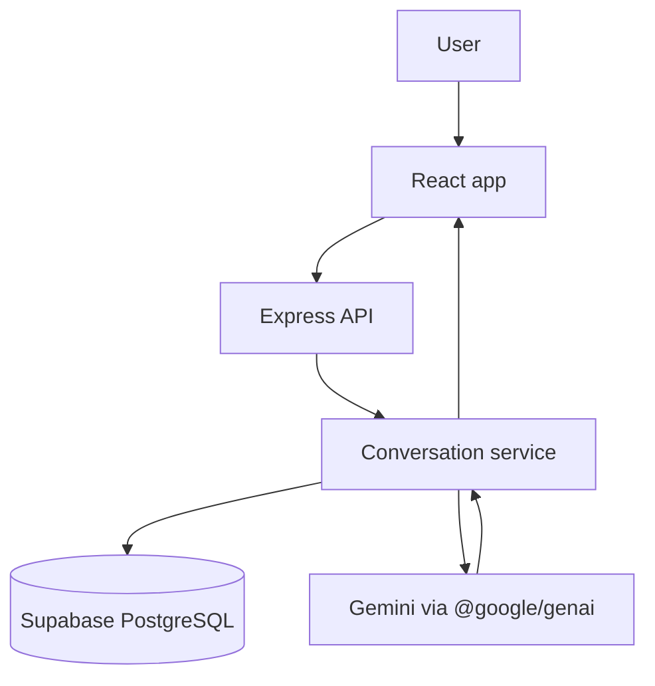

# Signal AI

A conversational AI assistant for technology, music, and everything in between. The main chat does not require uploaded documents or vector search.

## Architecture



The backend keeps the existing `route -> controller -> service -> repository -> PostgreSQL` structure. Normal chat loads up to 20 recent messages from the owned conversation, adds the selected mode instruction, calls Gemini, and persists both messages. Existing documents, chunks, and pgvector tables remain in the database for a possible future attach-knowledge feature but are not used by default chat.

## Features

- JWT registration, login, and protected account routes
- Chat modes: General, IT, and Music
- Persistent conversations with recent context, rename, and delete
- Markdown/GFM, highlighted code blocks, copy response/code, and regenerate
- Bounded retry on temporary Gemini errors

## Stack

- Frontend: React, Vite, React Router, Axios, React Markdown, remark-gfm, highlight.js
- Backend: Node.js ES modules, Express, `pg`
- Database: Supabase PostgreSQL
- AI: Gemini through the official `@google/genai` SDK
- Legacy document/RAG modules remain dormant from normal chat

## Requirements

- Node.js 20+
- pnpm
- Supabase PostgreSQL
- Google Gemini API key

## Database setup

For a fresh database, run migrations `001` through `006` in `backend/database/migrations/` in order. For the existing development database, apply only migrations not yet run. Migration `006_add_conversation_mode.sql` adds `conversations.mode` with a default of `general` and a constraint for `general`, `it`, and `music`.

The prior document feature's `vector(768)` schema stays in place but is not queried by main chat. Document tables and data are not dropped.

## Environment

Set these in `backend/.env`:

- `PORT=5000`
- `DATABASE_URL` for Supabase PostgreSQL
- `GEMINI_API_KEY` (backend only)
- `JWT_SECRET`

Set `VITE_API_URL=http://localhost:5000/api` in `frontend/.env`. Never expose `DATABASE_URL`, `JWT_SECRET`, or `GEMINI_API_KEY` to the frontend. `.env` files are ignored by git.

## Install and run on Windows CMD

Backend, in one CMD window:

```bat
cd /d C:\AI-Knowledge-Base\backend
pnpm install
pnpm dev
```

Frontend, in a second CMD window:

```bat
cd /d C:\AI-Knowledge-Base\frontend
pnpm install
pnpm dev
```

Open `http://localhost:5173`. Run commands from each package directory. Frontend dependency changes require `pnpm install` to refresh the lockfile.

## API overview

Protected routes require `Authorization: Bearer <token>`.

- `POST /api/auth/register`, `POST /api/auth/login`, `GET /api/auth/me`
- `POST /api/conversations` with `{ "mode": "it" }`
- `GET /api/conversations`, `GET /api/conversations/:id`, `PATCH /api/conversations/:id`, `DELETE /api/conversations/:id`
- `GET /api/conversations/:id/messages`, `POST /api/conversations/:id/messages`
- `POST /api/conversations/:id/messages/regenerate`

Valid chat modes are `general`, `it`, and `music`. Conversation ownership is checked on every read/write. `/api/health` reports PostgreSQL/Gemini and legacy vector readiness.

## Test prompts

- General: “Explain why the sky is blue in simple language.”
- IT: “My Node.js API returns HTTP 500. How should I troubleshoot it?”
- Music: “How do I create a dreamy shoegaze guitar tone?”

These should work even if the documents and `document_chunks` tables are empty. Messages are stored in PostgreSQL and recent context is capped at 20 messages per Gemini request.
